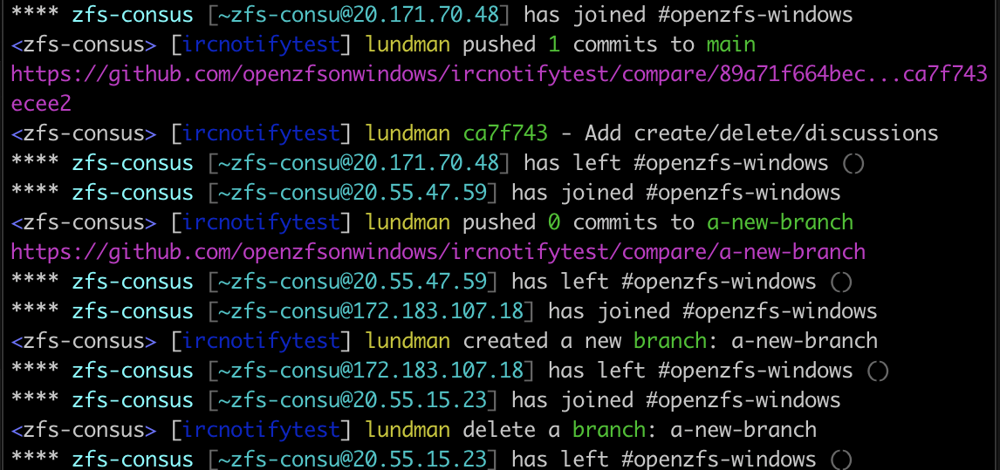

# Send Notification Message to IRC

### Usage

See [action.yml](./action.yml) For comprehensive list of options.

This is a fork of https://github.com/rectalogic/notify-irc
but I had issues getting it to send multiline messages.
This has been tweaked to issue IRC notifications mimicking
the style of `n.tkte.ch`'s Notifico. 

Jorgen Lundman <lundman@lundman.net>

V1:
   Add --ansicolor

V2:
   Add --mirccolor
   * It seems MIRC color works in more IRC clients than ANSI.


Example, send notifications to Libera Chat IRC channel:

```yaml

name: Notify IRC

on:
  push:
  issues:
    types:
      - opened
      - edited
      - closed
  issue_comment:
  pull_request:
  discussion:
    types:
      - created
      - edited
      - closed
      - answered
  discussion_comment:
  create:
  delete:

jobs:
  notify-irc:
    runs-on: ubuntu-latest

    steps:
      - name: Notify IRC
        uses: openzfsonwindows/notify-irc@v2
        with:
          channel: "#yourchannel"
          server: "irc.server.net"
          nickname: "irc-bot-name"
          mirccolor: "true"
          eventpath: ${{ github.event_path }}

```



